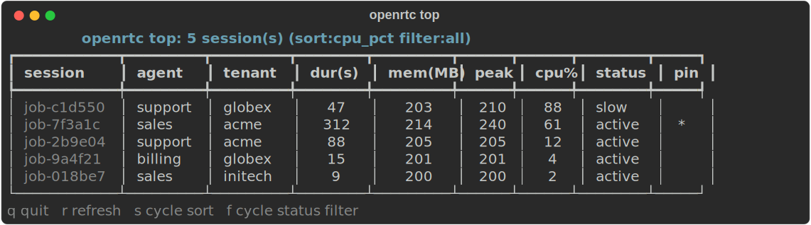
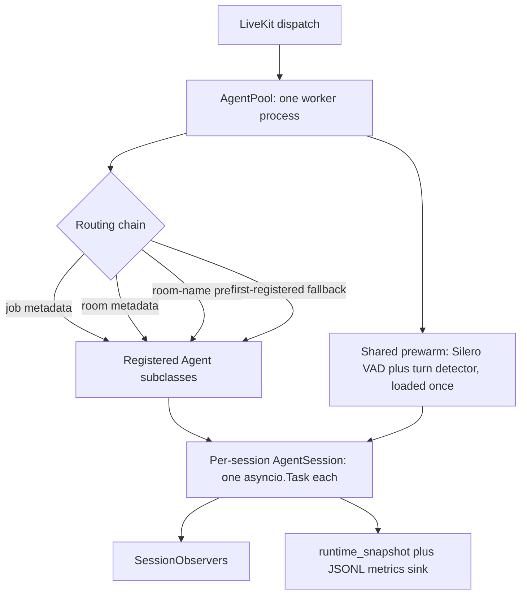

<div align="center">

<a href="https://github.com/mahimailabs/openrtc-runtime">
  
</a>

<p>
  <a href="https://openrtc.mintlify.app"></a>
  <a href="https://pypi.org/project/openrtc/"></a>
  
  <a href="https://docs.livekit.io/agents"></a>
  <a href="LICENSE"></a>
</p>

[**Docs**](https://openrtc.mintlify.app) · [**Quick start**](#quick-start) · [**Isolation**](#isolation-modes) · [**Routing**](#routing) · [**Introspection**](#session-introspection) · [**Multi-tenancy**](#multi-tenancy) · [**Deploys**](#zero-downtime-deploys) · [**API**](#public-api-at-a-glance)

</div>

```python
from openrtc import AgentPool
from my_agents import RestaurantAgent, DentalAgent, SupportAgent

pool = AgentPool()                       # one worker, prewarm once
pool.add("restaurant", RestaurantAgent)  # standard livekit.agents.Agent subclasses
pool.add("dental", DentalAgent)
pool.add("support", SupportAgent)
pool.run()                               # N agents share one Silero VAD + turn detector
```

A thin multi-agent layer for [LiveKit Agents](https://docs.livekit.io/agents). Register many standard `livekit.agents.Agent` subclasses on one `AgentPool` and host them in a single worker: shared prewarm (Silero VAD, turn detector) loads once instead of once per worker, and every incoming call still gets its own `AgentSession`. OpenRTC never introduces a base class and never sits between you and `@function_tool`, `RunContext`, `on_enter`, `on_exit`, or the `*_node` hooks. You change how many workers you run, not how you write an agent.

## Why OpenRTC

The default one-worker-per-agent model in `livekit-agents` reloads the same stack (Python runtime, Silero VAD, turn detector) in every process. OpenRTC answers the questions an operator actually asks:

- **How many agents per box?** One worker hosts every registered agent, each session an `asyncio.Task` over a shared `JobProcess`. The density benchmark clears 50+ concurrent sessions per worker under a 4 GB peak-RSS budget with headroom (see [Density](#density)).
- **Do I rewrite my agents?** No. Your `Agent` subclasses, tools, and provider objects are unchanged; you delete per-worker boilerplate (`entrypoint`, `AgentSession` wiring, `cli.run_app`) and register classes on one pool.
- **What does it cost in RAM?** Prewarm loads once per worker, not once per agent, so you stop paying resident set for copies you do not need.
- **What if I need hard isolation?** Pass `isolation="process"` for the one-subprocess-per-session model with independent crashes and livekit's per-session memory caps.

## Features

| Capability | What it gives you |
| :--- | :--- |
| **One worker, many agents** | Register N standard `Agent` subclasses on a single `AgentPool`; dispatch resolves one per call. |
| **Shared prewarm** | Silero VAD and the turn detector load once per worker in coroutine mode, not once per agent. |
| **Coroutine or process isolation** | Default coroutine runs each session as an `asyncio.Task`; `process` keeps one subprocess per session with hard isolation. |
| **Metadata routing** | Ordered resolution across job metadata, room metadata, room-name prefix, then first-registered fallback. |
| **Hot reload** | Edit an agent file and `openrtc dev` swaps live sessions on their next turn, no dropped calls. A bad save rolls back. |
| **Session introspection** | `openrtc top` shows per-session memory, CPU, and event-loop blocks live for the shared worker (htop-style). |
| **Multi-tenancy** | Per-tenant provider keys, session caps, and a blast-radius circuit breaker, so an agency runs every client in one pool safely. |
| **Zero-downtime deploys** | Blue-green drain: the new worker version takes new calls while the old drains its in-flight calls to hangup, then exits. No dropped calls. |
| **Job scoping** | Per-job accept/reject filter so several workers can share one LiveKit project, each taking only its own rooms. |
| **Session observers** | Structural-typed async start/end hooks for telemetry, isolated so a slow or raising observer never crashes the session. |
| **JSONL metrics stream** | Append-only JSON Lines of pool snapshots and lifecycle events for `tail -f`, `jq`, or a log shipper. |
| **LiveKit-shaped CLI** | `start` / `dev` / `console` / `connect` / `download-files` plus an OpenRTC-only `list`, with an optional Rich dashboard. |
| **No base class** | Your `Agent` subclasses, `@function_tool`, `RunContext`, and node hooks stay exactly as written. |

Full release history: [docs/changelog.md](docs/changelog.md).

## Quick start

```bash
pip install openrtc            # or: uv add openrtc
pip install "openrtc[cli]"     # adds the openrtc CLI (rich + typer)
```

Requires Python 3.11 to 3.13 (`>=3.11,<3.14`; the transitive `onnxruntime` behind Silero and the turn detector has no 3.10 wheels). The base install pulls `livekit-agents[openai,silero,turn-detector]>=1.5,<1.7` and `watchfiles`. Ships a PEP 561 `py.typed` marker. Set `LIVEKIT_URL` / `LIVEKIT_API_KEY` / `LIVEKIT_API_SECRET` as for any LiveKit worker.

**Explicit registration with `add()`** when you want every agent named and configured in one place:

```python
from livekit.agents import Agent
from livekit.plugins import openai
from openrtc import AgentPool


class RestaurantAgent(Agent):
    def __init__(self) -> None:
        super().__init__(instructions="You help callers make restaurant bookings.")


pool = AgentPool(default_llm=openai.responses.LLM(model="gpt-4.1-mini"))
pool.add(
    "restaurant",
    RestaurantAgent,
    stt=openai.STT(model="gpt-4o-mini-transcribe"),
    tts=openai.TTS(model="gpt-4o-mini-tts"),
    greeting="Welcome to reservations.",
)
pool.run()
```

**One file per agent with `discover()`** when you prefer a module per agent and optional `@agent_config(...)`:

```python
from pathlib import Path
from livekit.plugins import openai
from openrtc import AgentPool

pool = AgentPool(
    default_stt=openai.STT(model="gpt-4o-mini-transcribe"),
    default_llm=openai.responses.LLM(model="gpt-4.1-mini"),
    default_tts=openai.TTS(model="gpt-4o-mini-tts"),
)
pool.discover(Path("./agents"))
pool.run()
```

```python
# agents/restaurant.py
from livekit.agents import Agent
from openrtc import agent_config


@agent_config(name="restaurant", greeting="Welcome to reservations.")
class RestaurantAgent(Agent):
    def __init__(self) -> None:
        super().__init__(instructions="You help callers make restaurant bookings.")
```

Without `@agent_config` the agent name defaults to the filename stem, and STT/LLM/TTS/greeting fall back to the pool defaults. Provider slots accept either instantiated plugin objects (`openai.STT(...)`) or shorthand strings (`"openai/gpt-4o-mini-transcribe"`), which the LiveKit runtime resolves at session construction. OpenRTC installs a sensible default `turn_handling` (multilingual turn detector with VAD interruption); override it per agent via `session_kwargs`. Define classes at module scope so spawn-based worker reload can import them. Depth: [openrtc.mintlify.app](https://openrtc.mintlify.app).

## Isolation modes

`AgentPool(isolation=...)` picks how each session runs inside the worker. Coroutine is the default; pass `isolation="process"` to opt into the one-subprocess-per-session model.

```python
pool = AgentPool(
    isolation="coroutine",         # default
    max_concurrent_sessions=50,    # advisory backpressure (coroutine only)
    consecutive_failure_limit=5,   # supervisor threshold (coroutine only)
    drain_timeout=30,              # seconds to wait for in-flight sessions on SIGTERM
    memory_warn_mb=1000,           # warn when worker RSS crosses this (0 disables)
    memory_limit_mb=0,             # 0 = disabled; >0 drains + restarts the worker
)
```

| Aspect | `coroutine` (default) | `process` |
| :--- | :--- | :--- |
| Sessions per worker | Many. One `asyncio.Task` per session over a shared `JobProcess`. | One. Each session is its own subprocess via `livekit-agents` `ProcPool`. |
| Prewarm (VAD, turn detector) | Loaded once per worker. | Loaded once per session subprocess. |
| Crash isolation | Cooperative: an unhandled exception is logged and the session marked `FAILED`; siblings continue. `consecutive_failure_limit` consecutive failures (default 5) schedule `aclose()` so the platform restarts the worker; one `SUCCESS` resets the counter. | Hard: each subprocess crashes independently. |
| Memory cap | Worker-level (one process): warns at `memory_warn_mb` and drains + restarts the worker at `memory_limit_mb`, measured against whole-worker RSS, not per session. | Per-session: livekit-agents enforces `memory_limit_mb` per subprocess. |
| Backpressure | `current_load() = active / max_concurrent_sessions`, reported to LiveKit dispatch. Advisory only (unclamped, not a hard gate); sessions past the threshold still launch. | `livekit-agents` default CPU-based load. |
| Dependency surface | Uses `livekit-agents` private job internals; pinned to `>=1.5,<1.7`. An unsupported version fails import with a message pointing to `isolation="process"`. | Public, version-stable API. |
| When to pick | High density on one host; cost-sensitive deployments. | Regulatory hard isolation; per-session memory caps. |

`max_concurrent_sessions` (50), `consecutive_failure_limit` (5), and `drain_timeout` (30) are validated as positive integers; `memory_warn_mb` (1000) and `memory_limit_mb` (0 = disabled) as non-negative numbers. On SIGTERM the worker drains: it stops accepting jobs and waits up to `drain_timeout` seconds for in-flight sessions before cancelling.

### Throughput and density

Two axes, two benchmarks. **Throughput** is the defensible "sessions per worker" number. N sessions share one event loop and one GIL, so the continuous cost is per-frame VAD inference (~50 fps per session). `tests/benchmarks/throughput.py` drives the real Silero VAD over synthetic 16 kHz PCM and measures steady-state event-loop p99. On one worker (macOS arm64, Python 3.13) it holds a flat ~1 to 2 ms p99 out to 100 concurrent sessions, far under a 100 ms SLO:

| Concurrent sessions | Steady-state loop p99 | Peak RSS |
| ---: | ---: | ---: |
| 10 | 0.9 ms | 134 MB |
| 25 | 1.2 ms | 154 MB |
| 50 | 2.0 ms | 197 MB |
| 100 | 1.1 ms | 264 MB |

**Memory** is the other axis. The stub-workload `tests/benchmarks/density.py` (memory only, and the current CI gate) holds 50+ sessions per worker under a 4 GB peak-RSS budget with headroom ([full table](docs/benchmarks/density-v0.1.md)). Process mode instead loads the runtime plus models per session (~3 GB each, see [docs/audit-2026-05-02.md](docs/audit-2026-05-02.md)), so the same 50 sessions would need ~150 GB; coroutine mode shares one process.

Read both as an on-loop-CPU plus memory ceiling, not a full-pipeline guarantee: the harness stubs the WebRTC/STT/LLM/TTS network path. Shared CI runners are too noisy for a p99 gate, so throughput ships report-only for now; measure on your own hardware before quoting a sessions-per-worker number.

**Prove it on your machine** (no LiveKit server, no API keys, no model download):

```bash
uv run python examples/density_demo.py                # 16 sessions
uv run python examples/density_demo.py --sessions 50  # the gap widens with N
```

```text
livekit-agents (process per session):   1861 MB total  (116.3 MB/session)
OpenRTC coroutine pool (one process):     195 MB total  ( 12.2 MB/session)
OpenRTC uses 9.5x less memory for the same 16 sessions.
```

## Routing

One worker hosts several agent classes, so each session resolves to one registered name. The chain is evaluated in order, and the first match wins:

1. `ctx.job.metadata["agent"]`
2. `ctx.job.metadata["demo"]`
3. room metadata `["agent"]`
4. room metadata `["demo"]`
5. room-name prefix match (agent name followed by a literal hyphen, e.g. `restaurant-call-123`)
6. first registered agent (fallback)

Within a source, `agent` outranks `demo`. Metadata may be a JSON object string or a mapping; blank strings, non-JSON strings, and JSON scalars are ignored and defer to the next strategy. The room-metadata strategies read `ctx.job.room.metadata` first (authoritative before `ctx.connect()`, when `ctx.room.metadata` is still empty).

A value naming an **unregistered** agent raises eagerly instead of falling through: `ValueError("Unknown agent '<name>' requested via <job metadata|room metadata>.")`. An empty pool raises `RuntimeError("No agents are registered in the pool.")`. Routing never falls back silently. Full rules: [routing docs](https://openrtc.mintlify.app).

### Scoping which rooms a worker accepts

Routing decides *which* agent handles a job the worker has already accepted. When several workers (or an OpenRTC worker beside a non-OpenRTC agent) share one LiveKit project, automatic dispatch offers **every** room to **every** worker, and the fallback above means a pool would accept foreign rooms and route them onto its first agent. Filter jobs at acceptance time so a worker only takes rooms it owns:

```python
# Convenience: accept a job only when an explicit signal (job/room metadata
# naming a registered agent, or a "<agent>-" room-name prefix) maps it to one
# of this pool's agents. Everything else is rejected.
pool = AgentPool(accept_only_registered_rooms=True)

# Full control: your own per-job accept/reject hook (typed with RequestFilter).
from openrtc import AgentPool, RequestFilter
from livekit.agents import JobRequest


async def only_support_rooms(req: JobRequest) -> None:
    if req.room.name.startswith("support-"):
        await req.accept()
    else:
        await req.reject()


support_filter: RequestFilter = only_support_rooms
pool = AgentPool(request_fnc=support_filter)
```

`request_fnc` is LiveKit's `on_request` hook, threaded straight through. The default is `None` (accept every job, unchanged). The two options are mutually exclusive.

## Session observers

Attach external telemetry to every session without subclassing or touching internals. Any object with two async methods satisfies the `SessionObserver` protocol (structural typing, no base class):

```python
from openrtc import AgentPool, SessionInfo, SessionOutcome


class LoggingObserver:
    async def on_session_start(self, info: SessionInfo, session: object) -> None:
        print(f"live: {info.agent_name} in {info.room_name}")

    async def on_session_end(self, info: SessionInfo, outcome: SessionOutcome) -> None:
        print(f"done: {info.agent_name} -> {outcome.status.value}")


pool = AgentPool(observers=[LoggingObserver()])   # or pool.add_observer(...)
```

`on_session_start` receives the live `AgentSession` (subscribe to its metrics there). `on_session_end` receives a `SessionOutcome` with status `SUCCESS`, `FAILED`, or `CANCELLED`, and may fire without a matching start if a session dies before going live. Observer calls are isolated: a slow or raising observer is logged and skipped, never crashing the session. Register before `run()`; under `process` isolation an observer must be picklable, so build live resources lazily inside `on_session_start`.

## Hot reload

Edit an agent file while calls are in flight, and OpenRTC swaps every live session to the new class on its next turn. This is something `livekit-agents` cannot do (each session is its own process); OpenRTC can because the agent class is a shared-memory object.

```bash
openrtc dev ./agents        # coroutine mode watches your files; on by default
openrtc dev ./agents --no-watch          # opt out
openrtc dev ./agents --watch-path ./lib  # watch extra paths
```

On save, the module is re-imported into a fresh namespace and validated (compile + import) **before** any swap. livekit's `update_agent` blocks new turns and drains the in-flight one, so the current turn finishes on the old class and the next runs the new, with no dropped audio. Guarantees:

- **Rollback-safe.** A `SyntaxError`, `ImportError`, or missing `Agent` subclass keeps the running class and logs the error with `file:line`. A bad save never poisons the pool.
- **Loud feedback.** Each reload logs `[reload] agent.py changed -> swapped N sessions in Xms`.
- **Opt-out for critical flows.** Wrap a block that must not change class mid-flight:

  ```python
  from openrtc import pin_reload

  with pin_reload(ctx.session):
      ...  # payment confirmation, multi-step auth: no swap until this exits
  ```

Hot reload is coroutine-mode only (process mode runs one subprocess per session). `openrtc start` never hot reloads. Enable it programmatically with `AgentPool(enable_hot_reload=True)`.

## Session introspection

Because coroutine mode runs many sessions in one process, OpenRTC attributes memory, CPU, and event-loop blocks back to individual sessions and surfaces them live. Run `openrtc top` next to a worker for an htop-style view:



```bash
openrtc dev ./agents      # coroutine mode, introspection on by default
openrtc top               # live inspector (q quit · r refresh · s sort · f filter)
openrtc top --once        # one snapshot for scripts / CI
```

`mem(MB)` is an equal share of process RSS (per-session numbers sum back to the real RSS); `cpu%` is a sampled share of on-CPU time; a session shows `slow` when it recently blocked the shared loop (a sync call starving the others). These are honest approximations of a shared process, documented with their caveats in [session introspection](https://openrtc.mintlify.app) and the [density debugging runbook](docs/runbooks/debugging-density.md). Introspection is coroutine-mode only and on by default; disable it with `AgentPool(enable_introspection=False)`.

> This is a **runtime density** tool. For cost, pipeline latency (STT/LLM/TTS), and quality metrics, use voicegateway: it consumes the `agent_name` and `metadata["tenant"]` OpenRTC emits and owns that lane. OpenRTC does not duplicate it.

## Multi-tenancy

Run every client (tenant) in one pool, isolated. A tenant is the `tenant` key in dispatch metadata (no key means the `"default"` tenant, so single-tenant setups are unchanged). Each tenant gets its own provider keys, its own session budget, and a blast-radius circuit breaker:

```python
pool = AgentPool(
    agent=SupportAgent,
    tenant_config={                                  # per-tenant STT/LLM/TTS + keys
        "acme": {"llm": openai.LLM(api_key="acme-key")},
        "globex": {"llm": anthropic.LLM(api_key="glx-key")},
        # omitted providers fall back to the agent's; a missing tenant warns once
    },
    max_sessions_per_tenant={"acme": 50, "globex": 100},   # one tenant can't starve others
    enable_tenant_circuit_breaker=True,              # a failing tenant is confined for a cooldown
)
```

Provider keys are never shared across tenants; a tenant at its cap is rejected while siblings keep accepting; and a tenant whose calls start failing has its new sessions rejected for a cooldown (then auto-recovers) without touching the healthy tenants. The tenant is on every worker-internal signal (`openrtc top --tenant`, scoped logs, `runtime_snapshot().sessions_by_tenant`) and on the `SessionObserver` payload, so voicegateway attributes per-tenant cost with no extra config. Agent code reads it with `from openrtc.context import current_tenant_id`.

Coroutine mode is shared-process isolation, not an OS sandbox: for a hard compliance wall run `isolation="process"` or a worker per tenant. Full model, guarantees, and limits: [multi-tenancy guide](docs/concepts/multi-tenancy.md), plus [onboarding](docs/runbooks/onboarding-a-tenant.md) and [incident](docs/runbooks/tenant-incident.md) runbooks.

## Zero-downtime deploys

Upgrade a worker fleet without dropping calls, using **blue-green drain**. The new version takes new calls; the old version stops accepting and lets its in-flight calls finish naturally, then exits. No live call is ever moved, so none is dropped (a live WebRTC session with in-flight STT/LLM/TTS streams is not migratable: see the [state inventory](docs/design/worker-state-inventory.md)).

```python
pool = AgentPool(agent=MyAgent, deployment_version="v2.0.0", audit_sink=to_siem)

snap = pool.runtime_snapshot()          # snap.deployment_version, snap.draining
pool.begin_drain()                      # stop taking new calls; in-flight run to hangup, then exit
```

OpenRTC runs one worker and supplies the primitives; the fleet orchestration (start the new version, shift traffic, retire the old) is your platform's job (a Kubernetes rolling update, a LiveKit worker rotation). The primitives: a `deployment_version` tag, graceful drain (`pool.begin_drain()` or SIGTERM), HMAC [signed membership](docs/compliance/audit-events.md#signed-membership) to keep a leftover old-version worker off new traffic, and deployment [audit events](docs/compliance/audit-events.md) for compliance. Mid-call migration is out of scope by design (drain sidesteps it). Full walkthrough: [deployments](docs/operations/deployments.md), [monitoring](docs/operations/monitoring-deploys.md), [rollback](docs/operations/rollback.md), and the [migration-vs-drain rationale](docs/concepts/migration.md).

## CLI

Install `openrtc[cli]` to put `openrtc` on your PATH. Five subcommands mirror the LiveKit Agents shape (`start`, `dev`, `console`, `connect`, `download-files`), plus an OpenRTC-only `list`. Pass the agents directory as the first positional path instead of `--agents-dir`.

```bash
openrtc list ./agents \
  --default-stt openai/gpt-4o-mini-transcribe \
  --default-llm openai/gpt-4.1-mini \
  --default-tts openai/gpt-4o-mini-tts

openrtc start ./agents                           # production worker (after exporting LIVEKIT_*)
openrtc dev   ./agents ./openrtc-metrics.jsonl   # 2nd positional path = --metrics-jsonl
```

Flags are scoped per command: `--json` / `--plain` / `--resources` on `list`; `--isolation` / `--max-concurrent-sessions` on the worker commands; `--no-watch` / `--watch-path` control [hot reload](#hot-reload) on `dev`; the metrics and dashboard flags on the worker commands and `connect`. `--metrics-jsonl` appends one JSON object per line (an envelope of `schema_version`, `kind` (`snapshot` or `event`), `seq`, `wall_time_unix`, and `payload`), interleaving pool snapshots with `session_started` / `session_finished` / `session_failed` events for `tail -f` or `jq`. OpenRTC-only flags are stripped before the handoff to LiveKit's CLI parser. Full flag lists: [docs/cli.md](docs/cli.md).

## Architecture



Prewarm runs once as the worker's setup function and caches VAD and turn detector in `proc.userdata`. For each job the universal entrypoint runs the routing chain, instantiates the chosen `Agent` subclass, builds an `AgentSession` from cached defaults plus per-agent overrides, and starts it as a task on the shared loop. Registration data is spawn-safe, so it survives serialization to worker subprocesses. [Architecture deep dive](https://openrtc.mintlify.app).

## Public API at a glance

The public surface is exactly `openrtc.__all__`, 14 names. Everything else is internal and not treated as stable.

| Export | What it is |
| :--- | :--- |
| `AgentPool` | The pool facade. Register agents, run one worker. |
| `AgentConfig` | Per-agent registration record from `add()` / `discover()` (spawn-safe dataclass). |
| `AgentDiscoveryConfig` | Per-file discovery metadata attached by `@agent_config`. |
| `agent_config` | Keyword-only decorator tagging an `Agent` subclass with name/stt/llm/tts/greeting. |
| `ProviderValue` | Type alias `str \| object` for STT/LLM/TTS slots (provider ID string or plugin instance). |
| `RequestFilter` | Type alias `Callable[[JobRequest], Awaitable[None]]` for a per-job accept/reject hook. |
| `SessionObserver` | `@runtime_checkable` protocol: async `on_session_start` / `on_session_end`. |
| `SessionInfo` | Frozen dataclass: `agent_name`, `room_name`, `job_id`, `metadata`, `started_at`. |
| `SessionOutcome` | Frozen dataclass: `status`, `error`, `ended_at`, `duration_seconds`. |
| `SessionStatus` | Enum: `SUCCESS`, `FAILED`, `CANCELLED`. |
| `FileWatcher` / `FileChange` | `watchfiles`-backed hot-reload watcher and its change record. |
| `pin_reload` / `is_pinned` | Context manager to exclude a session from mid-flow class swaps, and its predicate. |
| `__version__` | Resolved from `importlib.metadata`. |

**`AgentPool(...)`** (all keyword-only, all optional):

| Parameter | Default | Purpose |
| :--- | :--- | :--- |
| `default_stt` / `default_llm` / `default_tts` / `default_greeting` | `None` | Pool-wide defaults applied when `add()` / `discover()` does not override them. |
| `observers` | `None` | `Sequence[SessionObserver]` registered during init. |
| `isolation` | `"coroutine"` | `"coroutine"` or `"process"` worker isolation mode. |
| `max_concurrent_sessions` | `50` | Coroutine backpressure threshold (positive int). |
| `consecutive_failure_limit` | `5` | Coroutine supervisor threshold (positive int). |
| `drain_timeout` | `30` | Seconds to wait for in-flight sessions after SIGTERM (positive int). |
| `memory_warn_mb` / `memory_limit_mb` | `1000` / `0` | Worker memory watermarks in MB (non-negative; `0` disables). Worker-level RSS in coroutine mode; per-subprocess in process mode. |
| `enable_hot_reload` | `False` | Watch agent files and swap live sessions on the next turn (coroutine mode only). |
| `watch_paths` | `None` | Extra paths to watch; `None` auto-discovers the worker's user modules. |
| `request_fnc` | `None` | Per-job accept/reject hook (`RequestFilter`). `None` accepts every job. |
| `accept_only_registered_rooms` | `False` | Convenience filter: accept only rooms mapping to a registered agent. Mutually exclusive with `request_fnc`. |

**Methods:** `add`, `discover`, `list_agents`, `get`, `remove`, `add_observer`, `run`, `runtime_snapshot`, `drain_metrics_stream_events`. **Read-only properties:** `isolation`, `max_concurrent_sessions`, `consecutive_failure_limit`, `drain_timeout`, `memory_warn_mb`, `memory_limit_mb`, `enable_hot_reload`, `server`, `request_fnc`. `add()` raises on an empty or duplicate name and on an `agent_cls` that is not a `livekit.agents.Agent` subclass; direct `**session_options` override the same keys in `session_kwargs`.

<details>
<summary><b>Project structure</b></summary>

```text
src/openrtc/
├── __init__.py
├── py.typed
├── core/                  # foundational, flat (pool, config, discovery, wiring)
│   ├── pool.py            # AgentPool facade
│   ├── config.py          # AgentConfig, AgentDiscoveryConfig, agent_config
│   ├── discovery.py       # file-system discovery helpers
│   ├── serialization.py   # spawn-safe config serialization
│   ├── turn_handling.py   # turn-detector integration
│   └── wiring.py          # AgentSession assembly helpers
├── routing/               # base_routing.py + variant siblings + resolver
│   ├── base_routing.py    # RoutingStrategy protocol
│   ├── metadata_routing.py
│   ├── room_prefix_routing.py
│   ├── default_routing.py
│   ├── request_filter.py  # per-job accept/reject (scope which rooms a worker takes)
│   └── resolver.py        # ordered strategy chain
├── runtime/               # base_runtime.py + variant siblings + registry
│   ├── base_runtime.py    # RuntimeBackend protocol
│   ├── coroutine_runtime.py
│   ├── process_runtime.py
│   ├── coroutine_server.py
│   ├── prewarm.py         # shared prewarm helpers
│   ├── resources.py       # shared resource cache
│   ├── file_watcher.py    # FileWatcher / FileChange, hot reload
│   └── registry.py        # selects active runtime
├── observability/         # base_observer.py + base_sink.py + concretes
│   ├── base_observer.py   # SessionObserver protocol
│   ├── base_sink.py       # metrics sink protocol
│   ├── jsonl_sink.py      # JSONL metrics schema and writer
│   ├── metrics.py         # RuntimeMetricsStore, footprint helpers
│   ├── snapshot.py        # PoolRuntimeSnapshot dataclass
│   ├── resident_set.py    # RSS memory helpers
│   ├── savings.py         # cost-savings estimator
│   └── footprint.py       # per-session memory footprint
├── cli/                   # base_cli.py + variant siblings
│   ├── base_cli.py        # shared Typer args and parameter bundles
│   ├── main_cli.py        # top-level Typer app and subcommands
│   ├── dashboard_cli.py   # Rich dashboard and list output
│   ├── entry_cli.py       # lazy console entry / missing-extra hint
│   ├── livekit_cli.py     # LiveKit argv/env handoff, pool run
│   └── reporter_cli.py    # background metrics reporter thread
└── utils/                 # foundational, flat
    ├── types.py           # ProviderValue and related typing
    └── validation.py      # input validation helpers
```

</details>

## Contributing

```bash
git clone https://github.com/mahimailabs/openrtc-runtime
cd openrtc-runtime
uv sync --group dev
uv run pytest
```

Read [CONTRIBUTING.md](CONTRIBUTING.md) before opening a PR. CI runs Ruff and mypy (strict) alongside the suite, with a combined line + branch coverage gate at 99%.

## Community

[](https://star-history.com/#mahimailabs/openrtc-runtime&Date)

<a href="https://github.com/mahimailabs/openrtc-runtime/graphs/contributors">
  
</a>

## License

[MIT](LICENSE). Fork it, ship it.

Built by [Mahimai Raja](https://mahimai.dev), founder of [Mahimai AI](https://mahimai.ca), a voice AI company, in public. Standing on [LiveKit Agents](https://github.com/livekit/agents).
