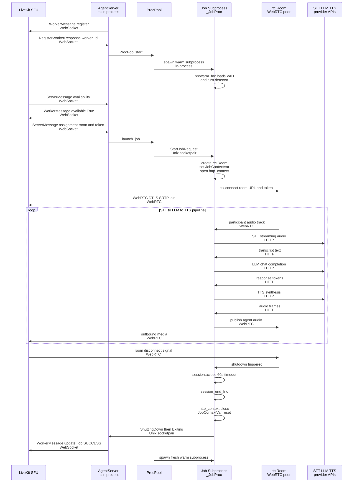
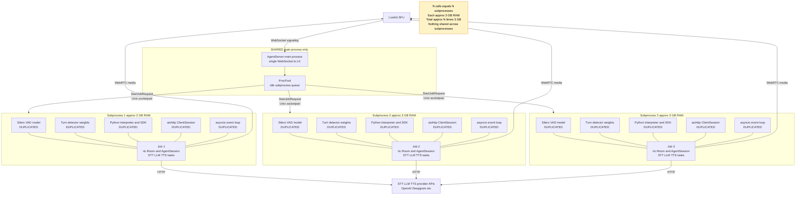
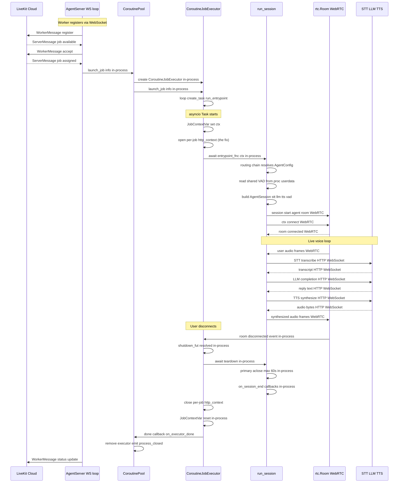
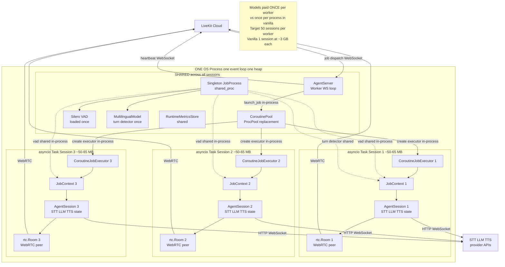
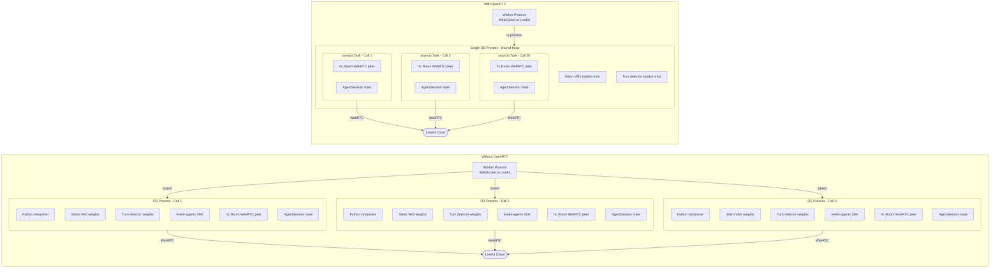
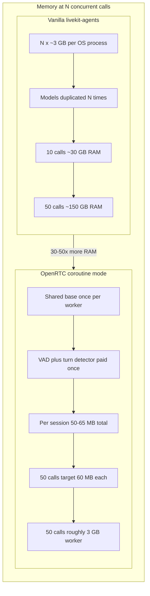

# OpenRTC architecture: with vs without OpenRTC

How a livekit-agents voice agent runs **on its own** (stock process-per-job) versus
**with OpenRTC** added (coroutine / density mode): how connections are passed, how
work is parallelized, and the start-to-end lifecycle of one call.

> Diagrams are grounded in the actual source (livekit-agents 1.6.2 in `.venv` and
> `src/openrtc`) and were adversarially checked against it. Each is embedded as
> Mermaid (renders on GitHub / VS Code) with rendered `.svg` and `.png` alongside.

The cast of connections is the same in both worlds; only the *runtime unit* changes:

| Connection | Transport | Carries |
| --- | --- | --- |
| Worker to LiveKit server | WebSocket (protobuf) | registration, job availability/assignment, status |
| Worker to job runtime | Unix socketpair (vanilla) / in-process call (OpenRTC) | start/shutdown signals |
| Job to room | WebRTC (DTLS/SRTP) | audio media |
| Plugins to STT/LLM/TTS | HTTP (shared aiohttp session) | provider API calls |

The one provider that bites in density mode (Cartesia TTS) uses that last HTTP path,
which is why the per-job http context matters: see `03` below.

---

## 1. Without OpenRTC: process-per-job

Stock livekit-agents. The worker holds one WebSocket to the LiveKit server and, for
**each** job, hands off to a **dedicated OS subprocess** from a warm pool. Every
subprocess independently loads its own VAD + turn-detector weights, opens its own
WebRTC peer and its own aiohttp session, and runs the STT to LLM to TTS pipeline as
concurrent asyncio tasks inside that one process. N concurrent calls means N
subprocesses, each ~3 GB (per the audit), sharing nothing.

### Lifecycle of one call

### Parallelization / topology (3 concurrent calls)

Note the HTTP edges go to the **external provider APIs** (OpenAI, Deepgram, Cartesia),
not to the LiveKit SFU; only WebRTC media goes to LiveKit.

---

## 2. With OpenRTC: coroutine / density mode

OpenRTC monkey-patches livekit's private `ipc.proc_pool.ProcPool` with a
`CoroutinePool`. There is now **one** long-lived worker process. Each incoming job
becomes an **asyncio task** in the shared event loop (a `CoroutineJobExecutor`) instead
of a subprocess. The VAD and turn detector are prewarmed **once** into the singleton
`JobProcess.userdata` and shared by every session. Each task still sets its own
`JobContextVar`, opens its **own per-job http context** (the in-flight fix), runs the
routing chain to pick the user's `Agent` subclass, and builds an `AgentSession` that
pulls the shared prewarmed VAD. Per-session cost drops to ~50-65 MB, so a single worker
targets 50+ sessions instead of ~1.

### Lifecycle of one call

The `open per-job http_context` step is the fix we are implementing: coroutine mode
mirrors livekit's `_JobContextVar` set/reset but currently skips the http context that
plugins like Cartesia TTS resolve lazily, which is the `Attempted to use an http session
outside of a job context` error.

### Parallelization / topology (3 concurrent calls)

`CoroutinePool` (the `ProcPool` drop-in) owns `max_concurrent_sessions` backpressure and
the consecutive-failure supervisor; it allocates one executor per job. The prewarmed VAD
and MultilingualModel turn detector are read in-process from `shared_proc` by every
session.

---

## 3. Side by side

### What is duplicated vs shared

### Memory / scaling at N concurrent calls

---

## The change in one breath

- **Runtime unit:** OS subprocess per job  ->  asyncio task per job (one process).
- **Models:** loaded once per process  ->  prewarmed once per worker, shared.
- **Memory:** ~3 GB x N  ->  shared baseline + ~50-65 MB x N.
- **Density:** ~1 session per process  ->  50+ sessions per worker.
- **Unchanged:** the connection cast (WebSocket signaling, WebRTC media, HTTP to
  providers) and the user's `Agent` subclass. OpenRTC swaps the *executor*, not the API.
